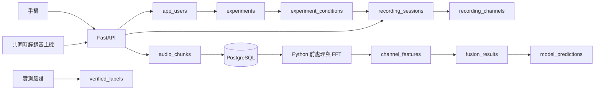
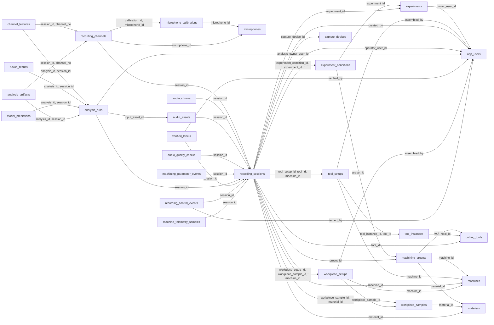

# 系統依賴與資料關聯

依 V1.2 規格繪製。服務節點代表預定介面。

```mermaid
flowchart LR
  mobile[手機] --> api[FastAPI]
  api --> app_users --> experiments --> experiment_conditions
  experiment_conditions --> recording_sessions
  host[共同時鐘錄音主機] --> api
  api --> recording_sessions --> recording_channels
  api --> audio_chunks --> db[(PostgreSQL)]
  db --> py[Python 前處理與 FFT] --> channel_features --> fusion_results --> model_predictions
  inspection[實測驗證] --> verified_labels
```

## SQL 外鍵

```mermaid
flowchart LR
  machining_presets -->|"machine_id"| machines
  machining_presets -->|"material_id"| materials
  machining_presets -->|"tool_id"| cutting_tools
  experiments -->|"owner_user_id"| app_users
  experiment_conditions -->|"experiment_id"| experiments
  experiment_conditions -->|"preset_id"| machining_presets
  workpiece_samples -->|"material_id"| materials
  tool_instances -->|"tool_id"| cutting_tools
  tool_setups -->|"machine_id"| machines
  tool_setups -->|"assembled_by"| app_users
  tool_setups -->|"tool_instance_id, tool_id"| tool_instances
  microphone_calibrations -->|"microphone_id"| microphones
  recording_sessions -->|"created_by"| app_users
  recording_sessions -->|"experiment_id"| experiments
  recording_sessions -->|"machine_id"| machines
  recording_sessions -->|"material_id"| materials
  recording_sessions -->|"tool_id"| cutting_tools
  recording_sessions -->|"preset_id"| machining_presets
  recording_sessions -->|"capture_device_id"| capture_devices
  recording_sessions -->|"experiment_condition_id, experiment_id"| experiment_conditions
  recording_sessions -->|"workpiece_sample_id, material_id"| workpiece_samples
  recording_sessions -->|"tool_setup_id, tool_id, machine_id"| tool_setups
  recording_sessions -->|"operator_user_id"| app_users
  recording_sessions -->|"workpiece_setup_id, workpiece_sample_id, machine_id"| workpiece_setups
  recording_channels -->|"session_id"| recording_sessions
  recording_channels -->|"microphone_id"| microphones
  recording_channels -->|"calibration_id, microphone_id"| microphone_calibrations
  audio_chunks -->|"session_id"| recording_sessions
  audio_assets -->|"session_id"| recording_sessions
  audio_quality_checks -->|"session_id"| recording_sessions
  machining_parameter_events -->|"session_id"| recording_sessions
  analysis_runs -->|"session_id"| recording_sessions
  analysis_runs -->|"input_asset_id"| audio_assets
  analysis_runs -->|"analysis_owner_user_id"| app_users
  channel_features -->|"analysis_id, session_id"| analysis_runs
  channel_features -->|"session_id, channel_no"| recording_channels
  fusion_results -->|"analysis_id, session_id"| analysis_runs
  model_predictions -->|"analysis_id, session_id"| analysis_runs
  verified_labels -->|"session_id"| recording_sessions
  verified_labels -->|"verified_by"| app_users
  workpiece_setups -->|"workpiece_sample_id"| workpiece_samples
  workpiece_setups -->|"machine_id"| machines
  workpiece_setups -->|"assembled_by"| app_users
  recording_control_events -->|"session_id"| recording_sessions
  recording_control_events -->|"issued_by"| app_users
  machine_telemetry_samples -->|"session_id"| recording_sessions
  analysis_artifacts -->|"analysis_id, session_id"| analysis_runs
  analysis_artifacts -->|"session_id, channel_no"| recording_channels
```
